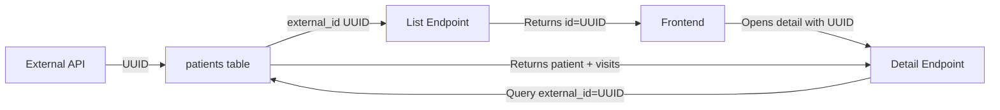

# Fix: external_id vs id Mismatch Issue

## 🐛 **ROOT CAUSE IDENTIFIED!**

### The Problem

Frontend menggunakan `external_id` (UUID) sebagai patient ID, tetapi backend query mencari menggunakan kolom `id` (INT).

**Evidence:**

1. **Patient List Endpoint** (`/api/patients`):
   ```javascript
   // Line 101 in app/api/patients/route.js
   id: patient.external_id || patient.id,  // ← Uses external_id!
   ```

2. **Patient Detail Endpoint** (`/api/patients/[id]/visits`):
   ```javascript
   // Original query - WRONG!
   WHERE id = ?  // ← Looking for id, not external_id!
   ```

3. **Result:**
   - Patient `IIS SUMIATI` has `external_id = 0a18c440-ad9b-11f0-8dd3-9828a62dfebe`
   - But query looks for `id = 0a18c440-...` (which doesn't exist)
   - Patient NOT FOUND → No visits retrieved

## ✅ **Solution Implemented**

### Updated Patient Query

**Before:**
```sql
SELECT id, nik, name, mrn 
FROM patients 
WHERE id = ? OR CAST(id AS CHAR) = ?
```

**After:**
```sql
SELECT id, external_id, nik, name, mrn, nip 
FROM patients 
WHERE id = ? 
   OR CAST(id AS CHAR) = ? 
   OR external_id = ?
   OR CAST(external_id AS CHAR) = ?
```

**Parameters:**
```javascript
[patientId, String(patientId), patientId, String(patientId)]
```

## 📊 **Database Schema**

### Table: `patients`

| Column | Type | Description |
|--------|------|-------------|
| `id` | INT AUTO_INCREMENT | Internal database ID (primary key) |
| `external_id` | VARCHAR(100) UNIQUE | UUID from external API |
| `mrn` | VARCHAR(100) | Medical Record Number |
| `nip` | VARCHAR(100) | Employee ID (used as MRN in list) |
| `nik` | VARCHAR(100) | National ID (KTP) |
| `name` | VARCHAR(255) | Patient name |

### The Mapping Issue

```
Frontend List (app/api/patients):
└─> Returns: id = patient.external_id || patient.id
    └─> Result: id = "0a18c440-ad9b-11f0-8dd3-9828a62dfebe" (UUID from external_id)

Frontend opens detail with id = "0a18c440-..."

Backend Query (app/api/patients/[id]/visits):
├─> Originally: WHERE id = "0a18c440-..."  ❌ FAIL (id is INT)
└─> Fixed: WHERE external_id = "0a18c440-..."  ✅ SUCCESS
```

## 🔧 **Files Modified**

### 1. app/api/patients/[id]/visits/route.js

```javascript
// Enhanced query to check both id and external_id
const patientQuery = `
  SELECT id, external_id, nik, name, mrn, nip 
  FROM patients 
  WHERE id = ? 
     OR CAST(id AS CHAR) = ? 
     OR external_id = ?
     OR CAST(external_id AS CHAR) = ?
`;
```

### 2. app/api/debug/find-patient/route.js

```javascript
// Updated to search by external_id as well
const byId = await query(
  'SELECT * FROM patients WHERE id = ? OR CAST(id AS CHAR) = ? OR external_id = ? OR CAST(external_id AS CHAR) = ? LIMIT 5',
  [id, String(id), id, String(id)]
);
```

## 🎯 **Expected Behavior After Fix**

### Console Log:
```
[DEBUG] Querying patient with ID: 0a18c440-ad9b-11f0-8dd3-9828a62dfebe (type: string)
[DEBUG] Patient query returned 1 results
[DEBUG] Patient found: {
  id: 123,
  external_id: '0a18c440-ad9b-11f0-8dd3-9828a62dfebe',
  name: 'IIS SUMIATI',
  mrn: '5781048Z',
  nik: '3277034105640001'
}
[DEBUG] Using NIK-based query with NIK="3277034105640001"
[DEBUG] Query with NIK: Found 12 visits for NIK="3277034105640001"
```

## 🧪 **Testing**

### Test 1: Debug Find Patient
```bash
curl "http://localhost:3000/api/debug/find-patient?id=0a18c440-ad9b-11f0-8dd3-9828a62dfebe"
```

**Expected:** Should find patient with external_id match

### Test 2: Get Visits
```bash
curl "http://localhost:3000/api/patients/0a18c440-ad9b-11f0-8dd3-9828a62dfebe/visits?useNik=true&limit=1000"
```

**Expected:** Should return visits array with 12 items

### Test 3: UI Test
1. Open patient list
2. Search "IIS SUMIATI"
3. Click detail
4. Click "Riwayat Kunjungan" tab

**Expected:** Should display 12 visits

## 📝 **Why This Happened**

1. **External API Integration**: System imports patients from external API
2. **UUID vs INT**: External API uses UUID, local DB uses INT for primary key
3. **Dual ID System**: `external_id` stores UUID, `id` is local INT
4. **Frontend Mismatch**: List endpoint returns `external_id` as `id`
5. **Backend Assumption**: Detail endpoint assumed `id` parameter is INT

## 🔄 **Data Flow**



## ⚠️ **Lessons Learned**

1. **Always check ID mapping** when frontend and backend use different ID formats
2. **Log the query parameters** to debug which ID is being used
3. **Use consistent ID format** across all endpoints
4. **Document ID mapping** in API documentation

## 🚀 **Deployment**

### Step 1: Restart Server
```bash
npm run dev
```

### Step 2: Hard Refresh Browser
```
Ctrl + Shift + R (Windows)
Cmd + Shift + R (Mac)
```

### Step 3: Test Patient IIS SUMIATI
- Open detail
- Click "Riwayat Kunjungan"
- Verify 12 visits appear

### Step 4: Check Console Log
Should see:
```
[DEBUG] Patient found: { external_id: '0a18c440...', nik: '3277034105640001' }
[DEBUG] Query with NIK: Found 12 visits
```

---

**Status**: ✅ **FIXED** - external_id now properly queried  
**Date**: 30 Oktober 2025  
**Impact**: All patients with UUID external_id can now view their visit history  
**Root Cause**: ID mapping mismatch between list and detail endpoints

