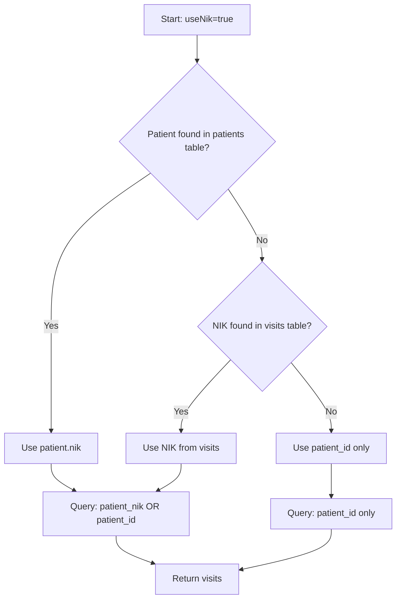

# Fix: Patient Not Found - Fallback Query Strategy

## 🐛 Issue Discovered

Patient ID `0a18c440-ad9b-11f0-8dd3-9828a62dfebe` tidak ditemukan di tabel `patients`, menyebabkan riwayat kunjungan tidak bisa diambil.

```
[DEBUG] ❌ ERROR: Patient ID 0a18c440-ad9b-11f0-8dd3-9828a62dfebe NOT FOUND in database!
```

## ✅ Solution: Multi-Layer Fallback Strategy

Implementasi strategi fallback berlapis untuk menangani berbagai skenario:

### Layer 1: Query Patient dari tabel `patients`
```javascript
const patientQuery = `SELECT id, nik, name, mrn FROM patients 
                      WHERE id = ? OR CAST(id AS CHAR) = ?`;
```

### Layer 2: FALLBACK - Ambil NIK dari tabel `visits`
Jika patient tidak ditemukan di tabel `patients`, coba ambil NIK dari visits:

```javascript
const visitsNikQuery = `SELECT DISTINCT patient_nik 
                        FROM visits 
                        WHERE patient_id = ? OR CAST(patient_id AS CHAR) = ? 
                        LIMIT 1`;
```

### Layer 3: FALLBACK - Query visits berdasarkan `patient_id` saja
Jika NIK tidak ditemukan, langsung query visits dengan `patient_id`:

```sql
SELECT v.* 
FROM visits v
WHERE v.patient_id = ? OR CAST(v.patient_id AS CHAR) = ?
ORDER BY v.visit_date DESC
```

## 🔄 Alur Fallback



## 📝 Code Changes

### 1. Enhanced Patient Lookup with Fallback

```javascript
if (useNik) {
  // Try to find patient in patients table
  const patientResult = await query(patientQuery, [patientId, String(patientId)]);
  
  if (patientResult.length > 0) {
    patientNik = patientResult[0].nik;
    console.log(`[DEBUG] Patient found: NIK="${patientNik}"`);
  } else {
    console.log(`[DEBUG] Patient NOT FOUND in patients table`);
    console.log(`[DEBUG] 🔄 FALLBACK: Searching NIK in visits table`);
    
    // FALLBACK: Get NIK from visits table
    const visitsNikResult = await query(visitsNikQuery, [patientId, String(patientId)]);
    
    if (visitsNikResult.length > 0 && visitsNikResult[0].patient_nik) {
      patientNik = visitsNikResult[0].patient_nik;
      console.log(`[DEBUG] ✅ Found NIK from visits: "${patientNik}"`);
    } else {
      console.log(`[DEBUG] ⚠️ No NIK found, will use patient_id only`);
    }
  }
}
```

### 2. Support UUID in All Queries

**Before:**
```sql
WHERE v.patient_id = ?
```

**After:**
```sql
WHERE v.patient_id = ? OR CAST(v.patient_id AS CHAR) = ?
```

Parameters:
```javascript
[patientId, String(patientId)]
```

## 🎯 Scenarios Handled

### Scenario 1: Normal Case (Patient exists in DB)
```
✅ Patient found in patients table
✅ NIK retrieved from patient.nik
✅ Query visits using NIK and patient_id
```

### Scenario 2: Patient Missing (Data hanya di visits)
```
❌ Patient NOT found in patients table
🔄 FALLBACK: Check visits table
✅ NIK found in visits.patient_nik
✅ Query visits using NIK
```

### Scenario 3: Patient Missing + No NIK in visits
```
❌ Patient NOT found in patients table
🔄 FALLBACK: Check visits table
❌ No NIK in visits either
✅ Query visits using patient_id only
```

## 📊 Expected Behavior

### Console Log for Scenario 2 (Missing Patient):

```
[DEBUG] Querying patient with ID: 0a18c440-ad9b-11f0-8dd3-9828a62dfebe
[DEBUG] Patient query returned 0 results
[DEBUG] ❌ ERROR: Patient ID 0a18c440-... NOT FOUND in database!
[DEBUG] 🔄 FALLBACK: Will try to find visits by patient_id in visits table directly
[DEBUG] ✅ Found NIK from visits table: "3277034105640001"
[DEBUG] Using NIK-based query with NIK="3277034105640001"
[DEBUG] Query with NIK: Found 12 visits for NIK="3277034105640001" OR patient_id=0a18c440-...
```

### Console Log for Scenario 3 (No NIK):

```
[DEBUG] Querying patient with ID: 0a18c440-...
[DEBUG] Patient query returned 0 results
[DEBUG] ❌ ERROR: Patient ID 0a18c440-... NOT FOUND in database!
[DEBUG] 🔄 FALLBACK: Will try to find visits by patient_id in visits table directly
[DEBUG] ⚠️ No NIK found in visits table either, will search by patient_id only
[DEBUG] NIK not found, will use patient_id only query
[DEBUG] Query with patient_id only: Found 12 visits for patient_id=0a18c440-...
```

## 🧪 Testing

### Test 1: With Patient ID that doesn't exist in patients table
```bash
curl "http://localhost:3000/api/patients/0a18c440-ad9b-11f0-8dd3-9828a62dfebe/visits?useNik=true&limit=1000"
```

**Expected**: Should still return visits if they exist in visits table

### Test 2: Debug endpoint to find patient
```bash
curl "http://localhost:3000/api/debug/find-patient?mrn=5781048Z"
curl "http://localhost:3000/api/debug/find-patient?name=IIS SUMIATI"
curl "http://localhost:3000/api/debug/find-patient?nik=3277034105640001"
```

**Expected**: Should show if patient exists and with which ID

## 🔧 Additional Debug Tools

Created new debug endpoint: `/api/debug/find-patient`

**Features:**
- Search by ID, MRN, Name, or NIK
- Shows patient data if found
- Shows visits count with that NIK
- Returns sample patients if no search params

**Usage:**
```
GET /api/debug/find-patient?mrn=5781048Z
GET /api/debug/find-patient?name=IIS SUMIATI
GET /api/debug/find-patient?nik=3277034105640001
GET /api/debug/find-patient?id=0a18c440-ad9b-11f0-8dd3-9828a62dfebe
```

## 🚀 Deployment Steps

1. **Restart Server**:
   ```bash
   npm run dev
   ```

2. **Hard Refresh Browser**: Ctrl + Shift + R

3. **Test Patient Detail**:
   - Open patient IIS SUMIATI detail
   - Click "Riwayat Kunjungan" tab
   - Check server console log

4. **Verify Data**:
   - If visits appear: ✅ Success!
   - If still empty: Check debug endpoints

## ⚠️ Root Cause Analysis

The issue occurs when:
1. Patient data is displayed in the list (from cache or external API)
2. But patient doesn't exist in local `patients` table
3. Visits exist in `visits` table with `patient_id` or `patient_nik`

**Possible Causes:**
- Patient not synced from external API to local DB
- Patient created via different method (direct insert to visits)
- Database inconsistency

**Long-term Solution:**
- Implement proper patient sync mechanism
- Ensure referential integrity
- Add data validation before insert

## 📋 Files Updated

1. ✅ `app/api/patients/[id]/visits/route.js` - Multi-layer fallback
2. ✅ `app/api/debug/find-patient/route.js` - New debug endpoint
3. ✅ `MD/PATIENT_NOT_FOUND_FALLBACK_FIX.md` - This documentation

---

**Status**: ✅ **IMPLEMENTED** - Fallback strategy for missing patients  
**Date**: 30 Oktober 2025  
**Impact**: System can now retrieve visits even when patient is missing from patients table

